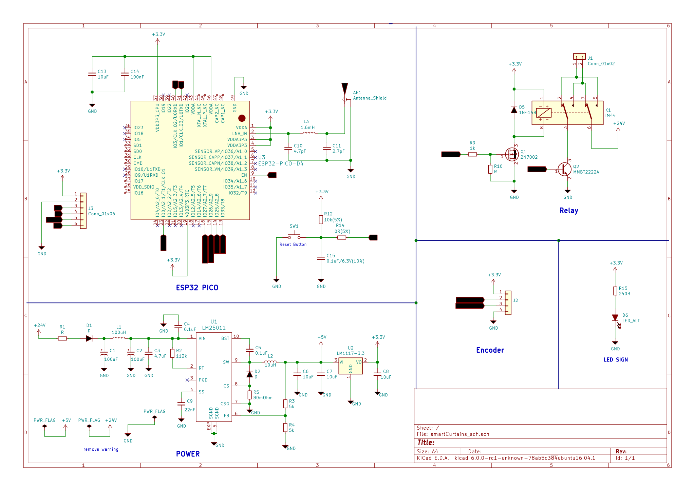

Project hardware control curtain 

# smart-curtain-hw

## Features

 - Power input 8VDC to 36VDC
 - ESP32 PICO D4:https://www.espressif.com/sites/default/files/documentation/esp32-pico-d4_datasheet_en.pdf
 - lm25011: http://modtronix.com/prod/components/regulator/lm25011.pdf
 - 4-wire encoder with DC motor 24VDC
 - 8-pin relay reversing DC motor
 - Design with KiCad

## Hardware

### Schematics

